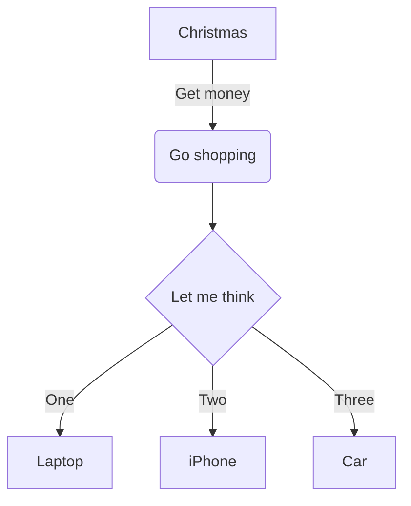

# Changelog

## Next

### Documentation in installation folder

The installation folder contains now some additional files, that were hidden inside the application data archive file:

- `README.md`
- `CONTRIBUTING.md`
- etc.

## 4.0.0 Content Blocking Memory

## Unblocked content can now be remembered (issue #61)

It is now possible, to unblock images permanently, meaning that media doesn't need to be unblocked again after restarting the application.

Clicking on a blocked image opens now a menu:


The blocked content banner has now a button for unblocking, that opens also a menu on clicking:


Clicking on "Temporary" behaves like clicking on the banner itself in previous versions.

Clicking on "Permanent" opens a dialog, allowing to select, which content shall stay unblocked:


## Single window position, independent of the document (issue #67)

The application settings have now an option for remembering the window position:

- **"Remember for each document" (default, as previous versions):** Remembers the window position for each document
- **"Remember single position":** The application opens the window always at the last previously opened position, independently of the opened document

## Bugfixes

### Issue #62

HTML anchors can now be defined also via `name`, additionally to the already supported `id` attribute.

Example: Alternatively of using

```html
<!-- Already supported previously -->
<a id="anchor-with-id"></a>
```

you can use

```html
<!-- Now supported, but deprecated in HTML standard -->
<a name="anchor-with-id"></a>
```

## 3.2.0 Bugfixes and minor UI additions

**Note:** The file `mdview-3.2.0-x64.exe` was marked as malicious on VirusTotal by "Bkav Pro" as "W32.AIDetectMalware".

### New menu entry "Window"

Currently, it isn't of much use under Windows, but it doesn't hurt either. It was done for porting the application to macOS.

### New CLI options

The application has two new command line switches for testing and diagnosis purposes:

- `--app-path`: Outputs the path to the installation directory and exits immediately
- `--data-path`: Outputs the path to the data directory (where besides other thinks, the settings are stored) and exist immediately

The Windows command line behaves weirdly when invoking the application. To workaround this, a batch file `mdview-cli.cmd` was added to the installation directory.

### Bugfixes

#### Issue #57

The recognition of file ending is case insensitive now, i.e. `.MD` is now the same as `.md`

#### Issue #58

The application now runs properly after installing globally via the MSI package.

#### Other

- Fixed a regression at the context menu that too many entries appeared

## 3.1.1 Bugfix for absolute paths

### Bugfix for absolute local paths

Issue #52

Absolute local paths to media and in links where not regarded by the application, leading to be broken.

### MSI package

Issue #53

This is the first release containing an MSI package.

## 3.1.0 Additional ways to zoom

There are now additional ways to zoom in and zoom out your document, change the sizes of the contents:

- Minus and plus keys on numpad
- Control + mouse wheel

See issue #50

## 3.0.2 Fix weird behaviors with certain headers

Issue #47

Certain header titles, e.g. "Content" could cause the application to behave weirdly or even break the usability.

## 3.0.1 Fix Application Crash at Invalid File Links

### Application crash at invalid file links

Issue #45

The application crashed after a click on a link to a non existing file. Now, only a meaningful error message is displayed.

### New About dialog

The About Dialog was reworked to fit better the other dialogs

## 3.0.0 Settings Dialog, Drag & Drop, Metadata

### Settings dialog

All settings are now reachable via a new settings dialog. It can be opened via main menu "Edit" --> "Settings..." or via `Ctrl+,`


### Drag & Drop

Issue #40

Any text file can now be dropped into the Markdown Viewer window to open it. By default, a dialog asks whether to open the file in the window were dropped or in a new window.

### Markdown Metadata

Issue #37

If a Markdown file contains a metadata header, it is now rendered properly. In the settings dialog is an option to hide this header.

### Recently Opened Files

Issue #41

The File menu now contains a list of recently opened files. The count can be adjusted in the settings.

### Bugfixes

- Mermaid diagrams are now displayed with readable colors in dark mode (issue #39)

## 2.8.0 Mermaid and Search

### Mermaid

Mermaid diagrams can now be displayed.

Example:

````

````


### Search

The application can now search for a term via Ctrl+F. F3 highlights the next occurrence of the term and Shift+F3 highlights the previous one.


## 2.7.0 Embed multimedia files

### Features

It is now possible to embed audio and video files.

Either via HTML (previous versions had a bug that prevented this):

```html
<video controls width="500">
    <source src="some-video.mp4" type="video/mp4">
</video>
```

Or via Markdown syntax, just like images:

```markdown

```

See [this page of the Chromium project](https://www.chromium.org/audio-video/) for supported formats.

### Bugfixes

- Minimum window size, introduced with 2.6.0, was too big for some users
- Inside the table-of-content area, the horizontal scrollbar was always visible and allowed to scroll when it shouldn't

### Developing

The local development instance now stores its settings inside the project directory.

## 2.6.2 Bugfix at keyboard handling

Since the introduction of the table of content feature, it was not possible to scroll via keyboard (arrow keys, page-up/-down) without clicking into the content first.

See issue #31

## 2.6.1 Bugfixes for Table of Content

- The TOC used black as font color for dark mode. Now, the TOC font has the same color as the rest of the UI
- Symbols to expand and collapse TOC entries are improved and should look the same in different operating systems.

Other fixes:

- Printing of wide tables was not fixed in a satisfactory manner. See issue #26

## 2.6.0 Table Of Content

The application can now display a Table of Content (TOC). The TOC is hidden by default. It can be displayed via entries in the "View" menu or by pressing Alt+C (Option+C on macOS) for a single document only or via Alt+Shift+C (Option+Shift+C on macOS) for all documents.

A bug regarding very wide tables as fixed. If a document was printed, wide tables could be cropped. See issue #26

## 2.5.1 Support for embedded Base64 image data

The tools now supports embedding an image as Base64 inside a data URL.

Example:

```markdown
![A PNG image](data:image/png;base64,iVBORw0KGgoAAAANSUhEUgAAAMkAAAB2CAIAAADtOCDyAAAAAXNSR0IArs4c6QAAAARnQU1BAACxjwv8YQUAAAAJcEhZcwAAEnQAABJ0Ad5mH3gAAAN9SURBVHhe7dhrcoIwAADhnosDeR5P42U4TBsgTwiKDttph/3+CSHGsgL261ti2JYotiWKbYliW6LYlii2JYptiWJbotiWKLYlim2JYlui2JYotiWKbYliW6LYlii2JYptiWJbotiWKLYlim2JYlui2JYotiWKbYliW6LYlii2JYptiWJbotiWKLYlim2JYlui2JYotiWKbYliW6LYlii2JYptiWJborzR1u3rudsjDsSNj7iW33tLve+PtXWsmjTIuP60z+6J+eSefW7H+3Bg4vG+vP9gWn/Zv2xL/wLSVrizDbGRYAiXlzHuWYyP+y3vz7vLna7Sf4M0NE8cmxzuY/Pmwy1smHY323qraZa7HJQ1y63Ua3v1ka/o/La6idQjOwPmnR+0NbU0S20F847KcNuG8XQxkzzx7oggz7IzpL/26zi5rXxPG+7xizt9oZdNcWw6Nn6zx/kbv2rk1XlJc2yPm1qaJw7Txg3BZls+MGyZLzJpnjwiLiBNHA8Il7Dm9bTp9Ue+qHPbWp2JKI2eB1f11GOiam/c0pVm3LZVHddb5N7Ci2ax+eU2pTTBgY98Vee2lbd3LYNzBkF9yZid2dbhbe3zVhQHrN5pe9068pEv6tS26mw60uByz1hUD8+/3tZqKUU+qBtP3nvwI18Sc91qbxBdy3PWMrwc8MttlTLyHTpNHQ9KI6ql3tJz1eyNj3w1zPPWevuu9QEHJzi7rSqMtq04INy6550dvXfR7Ny2yl86nK787V4uUfH8hRHlm59/luWTuztz4+y20kT59WZAZfpHR/VDpAzZ+8hXdXJb/bMx256+ojoJeerF9g0mZ7W1v9p80Go9RVnz7iS29YH0a6l/6tc/vKoL1aR50Fo/vgRj/U/7/tlJJzxfPj5tK2jeLvyqiHPHAfFVtY48Rb22Fx/5mj5r6ypSR81XqNesOmzrmXxDrP5LUraZ1nO29VQOaePiz1JH2NYL8RdfLCrwUeoo2xLFtkSxLVFsSxTbEsW2RLEtUWxLFNsSxbZEsS1RbEsU2xLFtkSxLVFsSxTbEsW2RLEtUWxLFNsSxbZEsS1RbEsU2xLFtkSxLVFsSxTbEsW2RLEtUWxLFNsSxbZEsS1RbEsU2xLFtkSxLVFsSxTbEsW2RLEtUWxLFNsSxbZEsS1RbEsU2xLFtkSxLVFsSxTbEsW2xPj+/gHoQQBYIGLfTAAAAABJRU5ErkJggg==)
```

## 2.5.0 Choose which files are rendered as Markdown

It is now possible to choose whether an opened file shall be rendered as Markdown or just as plain text. Based on the file name ending, it can also be chosen to render all files of a type (i.e. with the same ending) as Markdown or not.

---

This is the first release that also contains a Mac package (DMG for ARM).

**Note:** there are some usability issues currently and the application is not much tested yet (or much used by the author in practice). Future releases will hopefully bring improvements in this regard.

Also, the package is not signed, so expect some hassles at installing.

## 2.4.0 Support for Task lists

The application renders now task lists. See issue #19 for details.

Bugfixes:

- Images, those file names include a hash sign `#` were not displayed
- Fixed link to release page in README

## 2.3.1 Context menu regression fix

The context menu (right click) did not appear since the last version (2.3.0).

## 2.3.0 Markdown rendering options

Certain Markdown rendering features are now configurable:

- Whether line breaks in the middle of a paragraph shall be treated
- Converting Emoticons to Emojis
- Typographic replacements

## 2.2.1 Regression fix

The encoding recognition could lead the application to crash at opening certain documents.

## 2.2.0 File encoding recognization

The tool now recognizes the encoding of a Markdown file automatically. The encoding can still be set manually, if the encoding was not recognized correctly.

## 2.1.0 Additional settings

The application now remembers the last window position for each last opened document.

The content size can be changed via `Ctrl++` and `Ctrl+-`. `Ctrl+0` sets the content to the default size. This setting is independently from the document, i.e. the setting is application wide.

Some changes in appearance (thanks to [Loïs Bégué](https://github.com/khatastroffik)).

An about dialog was added (inspired by [Loïs Bégué](https://github.com/khatastroffik)).

Improved accessibility of the main menu via keyboard (inspired by [Loïs Bégué](https://github.com/khatastroffik)).

Bug fixes:

- Regression at handling of backslashes in document paths. Version 2.0.0 could not open documents that are on a Windows network share (with a path like `\\computer\share\path\to\file.md`).
- Markdown file recognition is now case insensitive (thanks to [Loïs Bégué](https://github.com/khatastroffik)).

## 2.0.0 Open links in same window

Links are now opened in the same window. If you want to open a link in a new window (previous default behavior), use the middle mouse button, i.e. pressing the mouse wheel.

See also issue #11

## 1.6.0 Additional Markdown rendering

Support for additional Markdown features was added. See the README file for more details.

## 1.5.0 Dark theme

The app does now support a dark theme.

## 1.4.4 Fix opening non Markdown files

Non Markdown text files were opened in raw text view mode. Expected behavior is to open them embedded in the source area of a Markdown file and disable the raw text view menu item.

## 1.4.3 Bugfixing

- Menu item File/Open works again (issue #10)
- URLs to local files inside of `<script>...</script>` do now work (issue #9)

## 1.4.2 Bugfixes

Some bugfixes by updating the dependencies

Additionally, when an external image is unblocked, the position is now preserved.

The Windows EXE files are now signed with self generated certificate in the hope that SmartScreen may whitelist the application one day.

## 1.4.1 Changed keyboard shortcuts

- An MDView window can be closed now vie the Esc key
    - Raw text view is now left via pressing Ctrl+U (was Escape before)
- Regression at reloading the opened file was fixed

## 1.4.0 File Encoding support

Markdown Viewer does now support different file encodings (see issue #4). Additionally, the set encoding is remembered for each file (issue #5).

Some bug fixes (issue #3 and a regression).

## 1.3.0 Auto refresh

Displayed content is now refreshed automatically when the file is modified.

Additionally, some bugfixes.

## 1.2.0 Print feature

It is now possible to print the current document. A view for the raw Markdown text is also integrated.

## 1.1.2 Bugfix

Links that are formatted as inline code are now handled properly.

Additionally, a Linux AppImage package is also added with this release - though not tested yet.

## 1.1.1 Display improvements

- Font rendering is improved
- Broken (or blocked) images are more recognizable
- The text in the bar elements do not break visibly anymore

## 1.1.0 Better handling of local non Markdown files

Links to local non Markdown files are now handled better. If the file is a binary file, it will be opened by the application associated in the operating system. Source code files are rendered with syntax highlighting now.

Additionally:

- Update of the Electron Framework
- The application title displays now the application version

There is now a bug regarding the display of blocked (and broken) images. This is caused by the current Electron framework. See [Electron issue 14426](https://github.com/electron/electron/issues/14426).

## 1.0.1 Bugfix

Headers with links were not transformed properly for the anchor elements

## 1.0.0 Context menu

Added a context menu that can:

- Copy the currently selected text
- Copy the link text under the mouse pointer
- Copy the link target of the link under the mouse pointer

The tool is now feature complete.

## 0.9.5 Regression fix

Clicking on file links did not work.

## 0.9.4 Block content from the Internet

Content that would be loaded from the Internet is now blocked by default. It is possible to unblock this content if desired.

Additionally some bugfixes.

## 0.9.3 Support for internal links

Links that lead to targets inside the document (starting with a hash "#") are now supported. As GitHub, headings are supported to be linked. A click on such link will open a new window where the document is positioned to the target.

Additionally, the content can now be refreshed by pressing F5.

## 0.9.2 Status bar added

There is now a status bar that shows information to certain elements while the mouse pointer is over them.

- Links: Shows the target URL
- Images: Shows the alternative text and the image URL

## 0.9.1 Local file handling

The tool handles links to local files and local images now properly. A links to a local file will be opened in a new window. A link to a website will be opened in the standard web browser.

## 0.9.0 Initial release

Initial release of Markdown Viewer. Some features are missing yet. See README file for further information.
