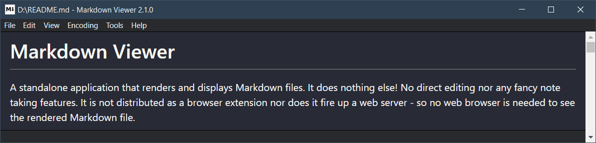

# Markdown Viewer

A standalone application that renders and displays Markdown files. It does nothing else! No direct editing nor any fancy note taking features. It is not distributed as a browser extension nor does it fire up a web server - so no web browser is needed to see the rendered Markdown file.

It renders many additional features from [the `markdown-it` demo](https://markdown-it.github.io/).

Following plugins are supported:

- [`markdown-it-abbr`](https://github.com/markdown-it/markdown-it-abbr)
- [`markdown-it-container`](https://github.com/markdown-it/markdown-it-container)
- [`markdown-it-emoji`](https://github.com/markdown-it/markdown-it-emoji)
- [`markdown-it-footnote`](https://github.com/markdown-it/markdown-it-footnote)
- [`markdown-it-headinganchor`](https://github.com/adam-p/markdown-it-headinganchor)
- [`markdown-it-mark`](https://github.com/markdown-it/markdown-it-mark)
- [`markdown-it-katex`](https://github.com/waylonflinn/markdown-it-katex)
- [`markdown-it-sub`](https://github.com/markdown-it/markdown-it-sub)
- [`markdown-it-sup`](https://github.com/markdown-it/markdown-it-sup)

## Installation and usage

You find the latest binaries and setup file [at GitHub](https://github.com/c3er/mdview/releases&/latest). For Windows, there is an installer package and a ZIP archive. For Linux, there is an AppImage package.

### Windows

The Windows setup file supports following parameters:

- `/S` runs the setup silently, i.e. in the background, without UI and without asking any questions.
- `/D=C:\path\to\install` sets the installation directory. This parameter has to be the last one. The path must not contain quotes, even if the path contains whitespaces.

## Known issues

### Windows installation and download security

Issues occurred with browser download security features and Windows SmartScreen. I checked both, the Windows Setup-EXE and the ZIP file in [VirusTotal](https://www.virustotal.com) and no engine detected anything at upload time.

I don't know yet, how to prevent these blockings without paying an annual fee.

### Startup speed

The application may have a delay at startup. This delay may be caused by Windows Defender. See [my comment in Electron issue #29868](https://github.com/electron/electron/issues/29868#issuecomment-869049066) and [this StackOverflow question](https://stackoverflow.com/questions/67982430/windows-defender-slowing-down-electron-startup). Other virus scanner may also cause a delay.

As a workaround to remove this delay, you can add the path to the `mdview.exe` to the exclusion list of your virus scanner. The default installation path of the setup file are:

- `C:\Program Files\mdview` for system wide installation
- `%appdata%\..\Local\Programs\mdview` for installation in the user account (non elevated)

### Build error ERR_ELECTRON_BUILDER_CANNOT_EXECUTE (development)

You may encounter some issue when trying to build the Electron distribution (binaries) i.e. the build may (partially) fail.

A possible fix is described here [not able to build installer/uninstaller (ERR_ELECTRON_BUILDER_CANNOT_EXECUTE)](./doc/development-build-installer-issue.md)

## Developing

The tool is developed and tested only under Windows (7 and newer) 64 Bit yet.

[Node.js](https://nodejs.org/en/) including the NPM package manager is needed. If your Node.js version is too old, the unit tests and some other scripts may fail because of syntax errors. On a Linux machine you can [use NVM](https://www.freecodecamp.org/news/how-to-install-node-js-on-ubuntu-and-update-npm-to-the-latest-version/) to install the latest LTS version.

After cloning the Git repository, type `npm install`. NPM may put some warnings while installing the packages.

To start an instance while development, type `npm start`.

Binaries can be built by typing `npm run dist`. Under Windows, a ZIP package and a Setup.exe will be built. Under Linux, an AppImage file will be generated - though it is not tested by the author yet. MacOS is not tested yet and there are properly some settings missing to build the proper packages. Pull requests are welcome!

The icon is made with help of [Inkscape](https://inkscape.org/en/) and [ImageMagick](https://www.imagemagick.org). While the application icon does not look too bad, a proper icon for Markdown *documents* is missing yet.

Note: you may encounter some issue when trying to build the Electron distribution i.e. the build may (partially) fail. A possible fix is described here [not able to build installer/uninstaller (ERR_ELECTRON_BUILDER_CANNOT_EXECUTE)](doc/development-build-installer-issue.md)

### Debugging

The main process can be debugged with [Visual Studio Code](https://code.visualstudio.com/). A `launch.json` is in the repository.

The renderer process (`index.html` and `index.js`) must be debugged with help of the Electron development tools by calling in the main menu "Tools" -> "Developer tools" or by pressing the F10 key.

### Note for Windows

See [section Startup speed](#startup-speed) above. If you observe a big delay at application startup, you should add the  development path of the application to your virus scanner exclusion list. This workaround may also help with other Electron applications.

## Copyright and License

This tool is made by Christian Dreier. If you find a copy somewhere, you find the original at [GitHub](https://github.com/c3er/mdview).

You can use and copy this tool under the conditions of the MIT license.

## Further notes

There is [a fork of this project](https://github.com/khatastroffik/mdview) by [Loïs Bégué](https://github.com/khatastroffik).

## Todo

- Recognize the character encoding to display special characters automatically
