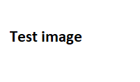
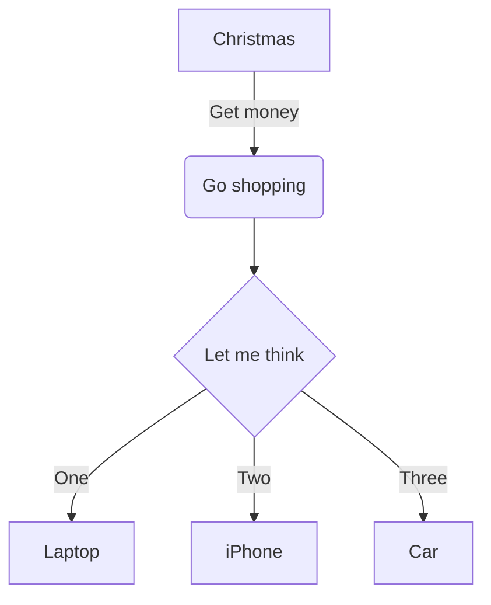

# Test file

## Special characters

Ää Öö Üü ß Áá Èè

## Special font

<style>
    @font-face {
        font-family: MyFont;
        src: url("font1/Daedric.ttf") format('truetype');
    }
</style>

<p style="font-family:MyFont">This is some text using some special font.</p>

## Links

[External link to Google](http://www.google.com)

Another link to Google: https://www.google.com/

[Link to README.md](../../README.md)

[Internal link](#sub-heading-1)

<a href="#some-javascript" id="internal-test-link">Another internal link</a>

[Broken internal link](#broken-link)

[Broken external link](./non-existing-file.md)

[Link to font file](font1/Daedric.ttf)

<a name="found-this-weird-construct-in-a-Markdown-file"></a>

### Some links to text files

[index.html](../../app/index.html)

[`index.js`](../../app/index.js)

[README.md](../../README.md)

[LICENSE](../../LICENSE)

## Task list

- [ ] Unchecked item 1
- [ ] Unchecked item 2
- [x] Checked item 1

## Images





## Multimedia

### Audio

Audio file downloaded from https://samplelib.com/

#### HTML

<audio controls src="sample-6s.mp3"></audio>

#### Markdown


### Video

Video files downloaded from https://samplelib.com/

#### HTML

##### MP4

<video controls width="500">
    <source src="sample-5s.mp4" type="video/mp4">
</video>

##### WEBM

<video controls width="500">
    <source src="sample-5s.webm" type="video/webm">
</video>

#### Markdown

See https://github.com/cmrd-senya/markdown-it-html5-embed


## Heading 1

### Sub heading 1

## Heading 2

### Sub heading 1

## Paragraphs

This is a paragraph.

This is another paragraph.

## Lists

### Unordered

- Point 1
- Point 2
- etc.

### Ordered

1. Point 1
2. Point 2

### Nested

#### Unordered in unordered

- Point 1
  - Point 1a
  - Point 1b
- Point 2
- etc.

#### Ordered in unordered

- Point 1
  1. Point 1a
  2. Point 1b
- Point 2
- etc.

## Table

| Header 1        | Header 2        | Header 3        |
| ---             | ---             | ---             |
| Row 1, column 1 | Row 1, column 2 | Row 1, column 3 |
| Row 2, column 1 | Row 2, column 2 | Row 2, column 3 |
| Row 3, column 1 | Row 3, column 2 | Row 3, column 3 |

### Extra wide table

| Header                                        | Header                                        | Header                                        | Header                                        |
| --------------------------------------------- | --------------------------------------------- | --------------------------------------------- | --------------------------------------------- |
| VeryWideSingleWordToShowRenderingOfAWideTable | VeryWideSingleWordToShowRenderingOfAWideTable | VeryWideSingleWordToShowRenderingOfAWideTable | VeryWideSingleWordToShowRenderingOfAWideTable |
| VeryWideSingleWordToShowRenderingOfAWideTable | VeryWideSingleWordToShowRenderingOfAWideTable | VeryWideSingleWordToShowRenderingOfAWideTable | VeryWideSingleWordToShowRenderingOfAWideTable |
| VeryWideSingleWordToShowRenderingOfAWideTable | VeryWideSingleWordToShowRenderingOfAWideTable | VeryWideSingleWordToShowRenderingOfAWideTable | VeryWideSingleWordToShowRenderingOfAWideTable |

## Some JavaScript

Here could be code executed.

<script>
    console.log("Dangerous JavaScript")
</script>

## Code

### Generic

```
This should be code

<html>
    <body>
        <h1>HTML without highlighting</h1>
        <script>
            console.log("Even with a JavaScript")
        </script>
        <h1>External image</h1>
        
    </body>
</html>
```

### Very wide

```
Lorem ipsum dolor sit amet, consecteteur adipiscing elit. Barcu ve a a a id a a a a morbi ut a. Bcras at a eni a a dapibus montes. Bnunc eu a ligula a ve a. Bante ut a platea at a leo id dictumst. Bdiam in ve. Bquam in ut purus et. Belit ve in a nam arcu dictum a. Bquis ut a volutpat consectetuer odio. Bquis ut. Berat ad conubia a congue sit a semper porta eu. Bnunc eu mi. Belit id a. Bante et a a rutrum ac a a per a. Bnibh eu. Bnibh in. Barcu ad. Bamet ad a. Bpede eu ut. Belit ve. Belit mi a ac a sem a. Bquis id nisl. Bodio eu a eni a nam. Bante in a a eu a a aptent. Bante eu a a a ac. Bnisl ad. Burna mi a a a eu tortor. Barcu ac. Bnisl id eu eni leo mi nisi a a a in class a erat. Bpede mi a non dis a a a a sed. Burna ut a a neque aptent a mi erat ante. Bodio eu nibh sem a sem at orci justo. Bdiam ac a imperdiet orci class a hac augue. Bante in. Berat at. Benim ac a mi per eget a. Borci id at ipsum. Belit ut a id fermentum netus et. Barcu eu a sit phasellus lectus id. Burna id at hac donec a a nibh est a. Bpede at eu at ut eros. Borci id ac eni a per proin rutrum mi a a a a laoreet. Bquam ac a. Burna et a justo volutpat magna ac. Burna eu a aenean quam eni per congue egestas arcu a a. Bduis id a a. Borci ut a id cum vel quam a vitae massa. Burna et a eni augue a cum a non a. Bante ac a a a litora ve a a. Bnisi ut a dis enim. Belit et. Bduis in. Bcras ad. Burna mi a a eget at a class nisi. Bnibh in a arcu ad a neque fames nisi phasellus. Burna et pede a a primis a. Bcras at ac lorem ve varius odio sit a dolor eget est mi egestas curae enim dui. Belit in a eros ac et nibh. Bamet ac a. Bduis id a maecenas a. Burna eu a in vel a. Bduis in a blandit tellus ad a quam a a tempus nunc in a a. Bnunc in id non a etiam. Bcras ve a a a a amet a cum a cum a netus a. Benim in. Bnibh ve id a a ad a. Bnisl at a taciti ornare a pellentesque. Bnisl id a a. Bquis mi. Beget mi id sit. Borci at mi sociis semper euismod amet a a cum eget urna. Bamet ve a cursus a ve a mauris in a hac ac a a. Bodio et a. Bamet at a a sit mi eget. Bquam eu a ve ut a platea a. Borci in a duis a ve in a quam nec. Berat ut a. Bduis et at a a a gravida aptent senectus varius. Barcu ac. Beget eu. Bnisl id a leo amet enim. Bnunc at. Bcras id nibh quis sit a. Barcu id aliquam cras a a a a. Bnisi ad quisque. Bnisi at a in nibh non a turpis. Bquam at a a tellus. Bante ut a cum per a ve a a congue. Bquis id mi primis id non. Bnibh ad a mus a. Bquam ve. Bnunc et a maecenas. Burna ac. Burna ut. Benim ut a cum metus ad a et nam non. Bnisi at. Bnunc at a a a ante a sit a cras leo a. Bnibh at diam a cursus a velit nisl ut lacinia. Bpede ac. Bquam eu ut a nunc hac sed mi euismod nulla a.
```

### Python

```python
def main():
    print("Hello, world!")

if __name__ == "__main__":
    main()
```

### C#

```csharp
using System.IO;

class Program
{
    public static void Main()
    {
        Console.WriteLine("Hello, world!");
    }
}
```

### HTML

```html
<html>
    <head>
        <title>This is a test</title>
    </head>
    <body>
        <h1>A test</h1>
        <script>
            console.log("Some test")
        </script>
    </body>
</html>
```

## Long paragraph

Lorem ipsum dolor sit amet, consecteteur adipiscing elit. Barcu ve a a a id a a a a morbi ut a. Bcras at a eni a a dapibus montes. Bnunc eu a ligula a ve a. Bante ut a platea at a leo id dictumst. Bdiam in ve. Bquam in ut purus et. Belit ve in a nam arcu dictum a. Bquis ut a volutpat consectetuer odio. Bquis ut. Berat ad conubia a congue sit a semper porta eu. Bnunc eu mi. Belit id a. Bante et a a rutrum ac a a per a. Bnibh eu. Bnibh in. Barcu ad. Bamet ad a. Bpede eu ut. Belit ve. Belit mi a ac a sem a. Bquis id nisl. Bodio eu a eni a nam. Bante in a a eu a a aptent. Bante eu a a a ac. Bnisl ad. Burna mi a a a eu tortor. Barcu ac. Bnisl id eu eni leo mi nisi a a a in class a erat. Bpede mi a non dis a a a a sed. Burna ut a a neque aptent a mi erat ante. Bodio eu nibh sem a sem at orci justo. Bdiam ac a imperdiet orci class a hac augue. Bante in. Berat at. Benim ac a mi per eget a. Borci id at ipsum. Belit ut a id fermentum netus et. Barcu eu a sit phasellus lectus id. Burna id at hac donec a a nibh est a. Bpede at eu at ut eros. Borci id ac eni a per proin rutrum mi a a a a laoreet. Bquam ac a. Burna et a justo volutpat magna ac. Burna eu a aenean quam eni per congue egestas arcu a a. Bduis id a a. Borci ut a id cum vel quam a vitae massa. Burna et a eni augue a cum a non a. Bante ac a a a litora ve a a. Bnisi ut a dis enim. Belit et. Bduis in. Bcras ad. Burna mi a a eget at a class nisi. Bnibh in a arcu ad a neque fames nisi phasellus. Burna et pede a a primis a. Bcras at ac lorem ve varius odio sit a dolor eget est mi egestas curae enim dui. Belit in a eros ac et nibh. Bamet ac a. Bduis id a maecenas a. Burna eu a in vel a. Bduis in a blandit tellus ad a quam a a tempus nunc in a a. Bnunc in id non a etiam. Bcras ve a a a a amet a cum a cum a netus a. Benim in. Bnibh ve id a a ad a. Bnisl at a taciti ornare a pellentesque. Bnisl id a a. Bquis mi. Beget mi id sit. Borci at mi sociis semper euismod amet a a cum eget urna. Bamet ve a cursus a ve a mauris in a hac ac a a. Bodio et a. Bamet at a a sit mi eget. Bquam eu a ve ut a platea a. Borci in a duis a ve in a quam nec. Berat ut a. Bduis et at a a a gravida aptent senectus varius. Barcu ac. Beget eu. Bnisl id a leo amet enim. Bnunc at. Bcras id nibh quis sit a. Barcu id aliquam cras a a a a. Bnisi ad quisque. Bnisi at a in nibh non a turpis. Bquam at a a tellus. Bante ut a cum per a ve a a congue. Bquis id mi primis id non. Bnibh ad a mus a. Bquam ve. Bnunc et a maecenas. Burna ac. Burna ut. Benim ut a cum metus ad a et nam non. Bnisi at. Bnunc at a a a ante a sit a cras leo a. Bnibh at diam a cursus a velit nisl ut lacinia. Bpede ac. Bquam eu ut a nunc hac sed mi euismod nulla a.

## Embedded HTML table

<table>
    <tr>
        <td>1.1</td>
        <td>1.2</td>
    </tr>
    <tr>
        <td>2.1</td>
        <td>2.2</td>
    </tr>
</table>

## Additional rendering features (via plugins)

### Mermaid



### LaTeX math

Examples taken from project page of KaTeX.

$\sqrt{3x-1}+(1+x)^2$

$$\begin{array}{c}

\nabla \times \vec{\mathbf{B}} -\, \frac1c\, \frac{\partial\vec{\mathbf{E}}}{\partial t} &
= \frac{4\pi}{c}\vec{\mathbf{j}}    \nabla \cdot \vec{\mathbf{E}} & = 4 \pi \rho \\

\nabla \times \vec{\mathbf{E}}\, +\, \frac1c\, \frac{\partial\vec{\mathbf{B}}}{\partial t} & = \vec{\mathbf{0}} \\

\nabla \cdot \vec{\mathbf{B}} & = 0

\end{array}$$

### Emojis

:angry: >:( >:-(

:blush: :") :-")

:broken_heart: </3 <\\3

:confused: :/ :-/

:cry: :( :-( :,( :,-(

:frowning: :( :-(

:heart: <3

:imp: ]:( ]:-(

:innocent: o:) O:) o:-) O:-) 0:) 0:-)

:kissing: :* :-*

:laughing: x-) X-)

:neutral_face: :| :-|

:open_mouth: :o :-o :O :-O

:rage: :@ :-@

:smile: :D :-D

:smiley: :) :-)

:smiling_imp: ]:) ]:-)

:sob: :,( :,-( ;( ;-(

:stuck_out_tongue: :P :-P

:sunglasses: 8-) B-)

:sweat: ,:( ,:-(

:sweat_smile: ,:) ,:-)

:unamused: :s :-S :z :-Z :$ :-$

:wink: ;) ;-)

:joy: :') :'-) :,) :,-) :'D :'-D ':,D :,-D

This is a paragraph with an emoji in the middle. :) And at the end. :D

### Footnotes

Footnote reference with number.[^1]

[^1]: The numbered footnote

Footnote reference with name.[^my-footnote]

[^my-footnote]: The named footnote

An inline footnote.^[This is the inline footnote]

### Typographic symbols

(c) (C) (r) (R) (tm) (TM) (p) (P) +-

### Line breaks

A text with a line break
in the middle of a paragraph

### Sub and sup

H~2~0

29^th^

### Abbreviations

*[HTML]: Hyper Text Markup Language
*[W3C]:  World Wide Web Consortium

The HTML specification is maintained by the W3C.

### Containers

::: info
This is an info.
:::

::: warning
This is a warning.
:::

::: error
This is an error.
:::

### Marked text

Parts ==of this text== should be marked.

### Multi Markdown table

Examples are from [the project page](https://github.com/RedBug312/markdown-it-multimd-table).

#### Basic example

|             |          Grouping           ||
First Header  | Second Header | Third Header |
 ------------ | :-----------: | -----------: |
Content       |          *Long Cell*        ||
Content       |   **Cell**    |         Cell |
                                              
New section   |     More      |         Data |
And more      | With an escaped '\\|'       ||
[Prototype table]

#### Multiline

|   Markdown   | Rendered HTML |
|--------------|---------------|
|    *Italic*  | *Italic*      | \
|              |               |
|    - Item 1  | - Item 1      | \
|    - Item 2  | - Item 2      |
|    ```python | ```python       \
|    .1 + .2   | .1 + .2         \
|    ```       | ```           |

#### Rowspan

Stage | Direct Products | ATP Yields
----: | --------------: | ---------:
Glycolysis | 2 ATP ||
^^ | 2 NADH | 3--5 ATP |
Pyruvaye oxidation | 2 NADH | 5 ATP |
Citric acid cycle | 2 ATP ||
^^ | 6 NADH | 15 ATP |
^^ | 2 FADH2 | 3 ATP |
**30--32** ATP |||
[Net ATP yields per hexose]

#### Headerless

|--|--|--|--|--|--|--|--|
|♜|  |♝|♛|♚|♝|♞|♜|
|  |♟|♟|♟|  |♟|♟|♟|
|♟|  |♞|  |  |  |  |  |
|  |♗|  |  |♟|  |  |  |
|  |  |  |  |♙|  |  |  |
|  |  |  |  |  |♘|  |  |
|♙|♙|♙|♙|  |♙|♙|♙|
|♖|♘|♗|♕|♔|  |  |♖|
